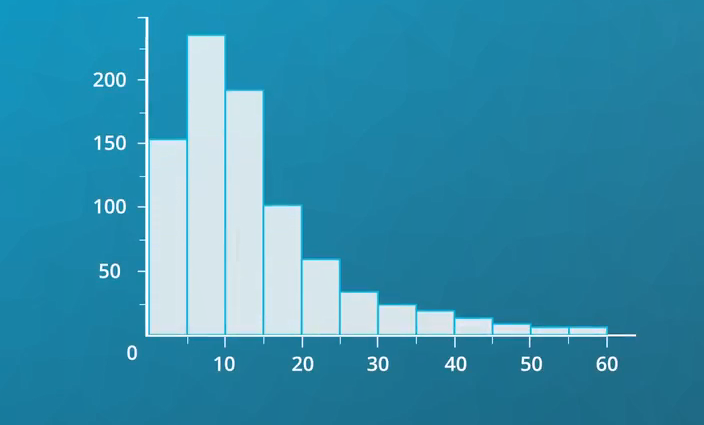

[TOC]

### 学习方法

- 无论要研究什么数据集，请记住你的研究目的既：**着重探索那些可以回答研究问题的关键变量**。
- 如果发现数据有异常，比如出现异常值、缺失值等，那么需要对此进行数据检查和清理。

### 目标

 - 探索**单变量**可视化，以便理解`变量值的分布情况`。
 - 学习展示**分类变量**的条形图，和展示**数值变量**的直方图。
 - **名词解释**
   - `分类变量 表示的是`离散值 = 条形图
   - `数值变量 表示的是`连续值 = 直方图

### 条形图

 - **条形图**适用于研究`分类变量`的分布，X 轴表示类别变量的各类别，Y轴表示频率,即每个类别数据点的数量。

 - **注意: 类别之间的固有顺序往往是更重要的信息**。

   ### 

#### 相对频率与绝对频率

​		由于`条形图Y轴表示的是绝对频率`，然而有时我们对**各类别数据占比感兴趣**，因此需要将Y轴表示为`相对频率`。

#### 计算缺失的数据

​	一般而言，如果你的数据已经过整理归纳,且你依然想要绘制条形图，那么该函数`barplot`很有用。但如果数据尚未归纳，则使用 `countplot` 函数，这样就不需要进行额外的归纳工作。

#### 饼状图

​	另一种**分类变量相对频率的图表**就是饼状图，但条形图的用途更广，是探索定性变量的首选。因为长条高度比面积或角度更精确，并且条形图可以比饼状图更紧凑。

- 第一 饼状图只适用展示**数据整体是如何由各个部分组成的**。

- 第二 只绘制少数几个扇形，把饼状图分成两个或三个扇形的效果最好。

### 直方图

​	直方图的 x 轴为元素值， y 轴为数量统计，注意直方图统计的 **不是单个值的数量，而是某个数值范围的统计数量**。

>  **通常 每一组都包含其左边界的值 但不包含其右边界的值**。

**注意**

​	组距对数据分析影响很大

- 组距太大
  **会丢失数据总体分布的很多信息。**

-  组距太小
  **会引入噪声 分散数据的主趋势。**

- 创建直方图时，多调整组距和边界值，可加深对绘制变量的理解。

#### Figures、Axes 和 Subplot

- matplotlib 中的可视化基本结构是 [Figure](https://matplotlib.org/api/_as_gen/matplotlib.figure.Figure.html) 对象。每个 Figure 中将包含一个或多个 [Axes](https://matplotlib.org/api/axes_api.html) 对象，每个 Axes 对象包含多个表示每个图表的其他元素。

#### 离散数据图形选择

 - 将**长条条边缘**设为**数据实际值之间的某个值**可以减少不确定性,和避免用户感到困惑。

   

 -  长条之间增加空隙，空隙强调值是离散的

   

#### 离群值和坐标轴范围

- 直方图易观察到数据异常值
     - 如果直方图涵盖了一个意料之外的区间，那有可能存在异常的数据点。
     - 如果数据有明显倾斜，可以先修改坐标轴范围，以便观察大多数数据点的分布情况。
- 案例

> 上图以**分钟为单位**统计的**单车骑行时长**统计图。

> 通过把坐标轴限制在 60 分钟内,组距设为 5 分钟，就可发现骑行时长**通常在 5 到 15 分钟内**。

#### 标尺和变换

​		通过对数据进行`线性分析`，主要考察`数据的差异性`，有时想观察 `数据比例`或`百分比`差异，或用`其它标尺`来表示变量。

- 案例： 这是汽车价格表，变量范围**会跨越多个数量级**，且向右倾斜。线性标尺的组距为1万。	

- 预测变量很难兼顾 **刻度值差异**，因此需要将**标尺改为对数标尺。**

- 通过变换 将标尺改为对数标尺，使坐标轴上的距离表示倍数差而非算术差，这种标尺通常会形成一种分布 对数正态分布。

- 使用变换 预测的线性变化会造成 价格出现倍增效应

- 注意:**这里的所有值都必须为正值 否则无法使用对数变换**。

### 核密度估计（KDE）

-  `核密度估计`是**变量的概率密度函数的一种方式**。
-  **曲线下方面积等于1**
-  **纵轴表示的是数据密度，而不是直接的概率。**

-  参考资料
   - [核密度估计-视频](https://www.bilibili.com/video/av60755082?from=search&seid=9416336708620472075)
   - [概率密度函数](https://www.jianshu.com/p/70b188d512aa)

### 总结

	- 主要学习了**单变量**的两种分析方法，一种是表示**分类变量的条形图**，一种是**值变量的直方图**。其中分类变量可以种绝对值和相对值表示，**直方图**统计的是组距范围的频率，因此**组距**的大小影响直方图的显示效果。
 -   常用显示函数
   1. 条形图：sb.countplot()
   2. 直方图：plt.hist()、sb.distplot()

  [代码整理](./matplotlib/数据可视化1-练习.ipynb)