[TOC]

### 目标

1. 描绘**双变量关系**的三种图表：
   	- 比较`两个数值变量`关系的 **散点图**。
   - 比较`数值变量和分类变量`关系的 **小提琴图**。
   - 比较`两个分类变量`关系的的 **分组条形图**。

2. 学习用双变量图表汇总数据的方法，以及用单变量图表，表示双变量数据的方法。

3. 名词解释
   	- `分类变量 `表示的是`离散值`
   - `数值变量`表示的是`连续值`

### 散点图和相关性

1. 研究`两个数值变量之间的关系`，通常选用**散点图**。x 轴对应一个特征值，y 轴对应另一个特征值。

2. 数据的每一次观察结果，都会在图中绘成一个点，慢慢地就形成了点群，点群的分布模式明确地体现了两个变量的`关系及其关系强度`

3. 两个变量的关系强度量化，通常皮尔逊相关系数的字母r表示。
    - 皮尔逊系数的值在 -1 和 1 之间，系数接近 1 或 - 1 时 变量关系更强、更容易预测，系数越接近 0 变量关系则越弱。
      		- 当系数为正时，一个变量发生正向变化，另一个变量也会发生正向变化。
        		- 当系数为负时，一个变量增加 另一个变量就会减少。
   - 皮尔逊系数**只能表示线性关系**，未必能确定线性关系的斜率。
   - 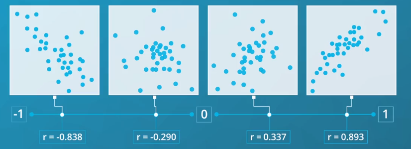
   - 观察数据的安斯库姆四重奏，会发现图像形状有明显差异，但数据集的皮尔逊相关系数是相同的。
     所以不仅要考虑`皮尔逊相关系数`本身，还要考虑这些数字对数据的意义。

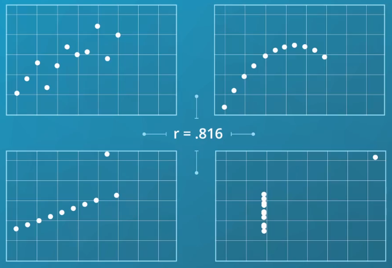

- 案例：

  通过变换标尺的方式，可以创建出**数据的回归模型**，既把自然单位下呈非线性趋势的数据 进行变换 使其呈现出线性趋势来。

  假设散点图是随着 x 值增加y 值的涨幅会越来越大。如果将**y 变量的标尺 改为 对数标尺**，线性模式就出现了。

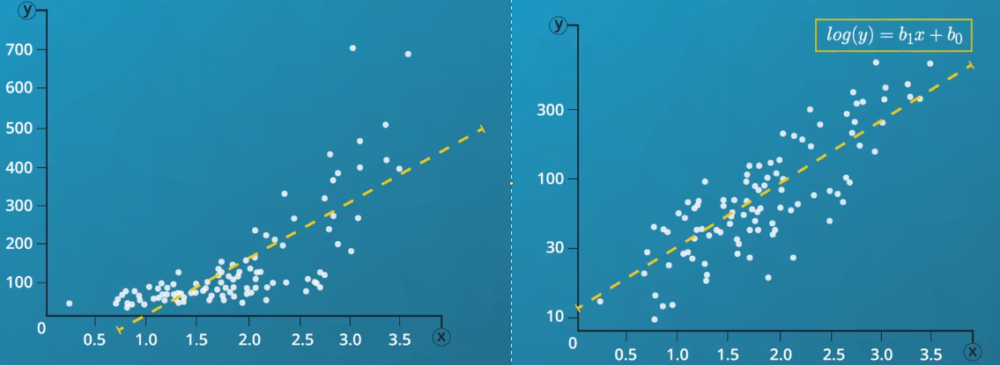

#### 重叠、透明度和抖动

​	`数据点重叠`既小范围内挤着太多数据点，这种情况下散点图需要使用**抽样、透明度调整和抖动**技术来处理。

1. 抽样

   通过随机抽样的方式，减少要绘制的数据点，这种范式不影响观察数据的总体分布。
   
2. 透明度

   - 通过**修改各数据点的透明度**，使得每个数据点颜色都会变得浅些，目的是为了**使数据点重叠区域颜色加深**。颜色越深，说明**数据点越多，也意味着这是分布的峰值。**

   - 由于密度高会导致颜色变深，所以借助颜色来增强**只用位置无法凸出的重点**。

   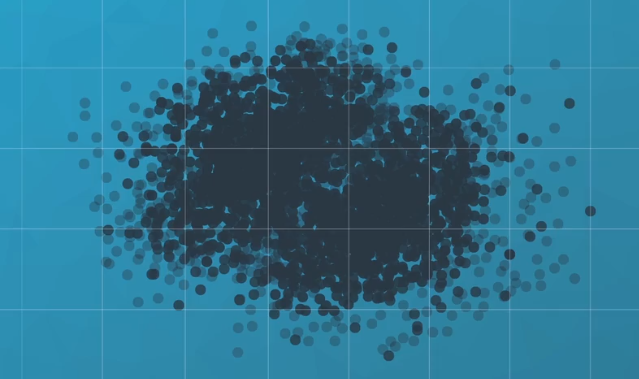

3. 抖动

   ​	对于离散型变量无论多少数据点重叠，看起来都一样。因此无法再用抽样进行处理。虽然可以通过调整透明度方式研究密度，但这样会损失一些位置信息。

   - 通过数据抖动,会给各点的位置增加一点随机噪声,抖动只在小范围内将值相同的多个数据点抖散，只要各离散值的抖动范围不重合，就能借助抖动找出数据趋势。

#### 热图

- 热图是一种明确**用双变量表示数据密度**的图表。由多个单元格组成的一个网格，并统计每个单元格里的数据点数，根据统计值 用不同颜色进行填充，单元格里的数据点越多颜色就越深。

- 热图是**直方图的二维版本**，可代替**散点图**，并且**热图只能用颜色表示**数据密度，但根据颜色很难`判断准确数值`，所以要给每个单元格**标上数量统计。**
- 如果两个变量都是离散型的，那**热图的效果比散点图要好**，毕竟对**散点图进行抖动处理后不那么精确了**。在数据庞大的情况下,除了**用散点图并调整透明度，也可用热图来展示。**
- 与直方图一样，要注意`组距对数据解析效果的影响`，组距太大，找不到数据的主要趋势。组距太小，会引入太多噪声。

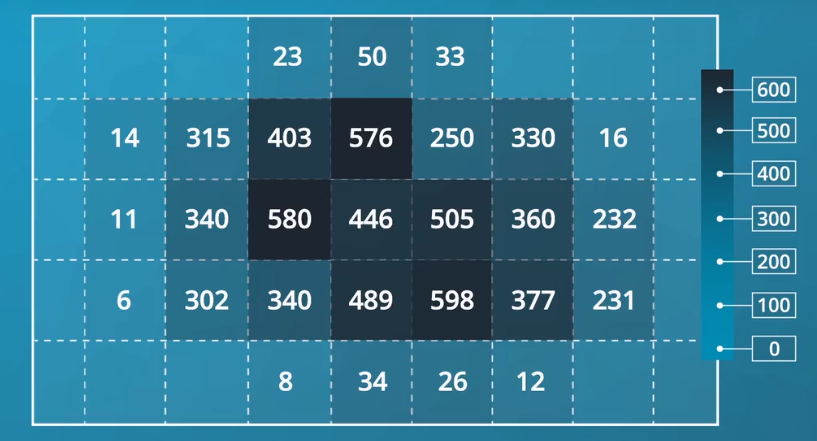

### 小提琴图

	- 可视化`数值变量`和`分类变量`的关系时，常用**小提琴图**进行展示。

- 小提琴图为**每个类别绘制曲线，并用曲线的面积来表示数据点的分布情况**，宽些的曲线意味着数据点较多。

  > 有点像`侧面视角的直方图`或`密度曲线` ，并进行了平滑处理。

- `小提琴图` 比 `抖动处理的散点图`更能体现分类变量的特征，也更方便`比较变量的分布情况`

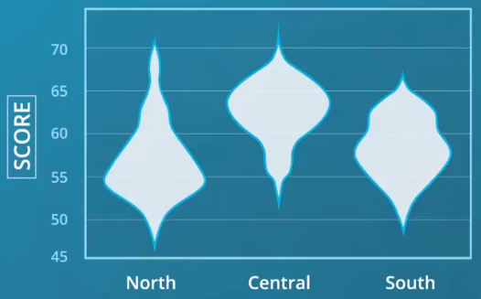

#### 箱线图

​	箱线图是展示**数值变量和分类变量之间关系的另一种方式**。与小提琴图相比，箱线图侧重于数据的摘要，主要描述每一级统计学信息。

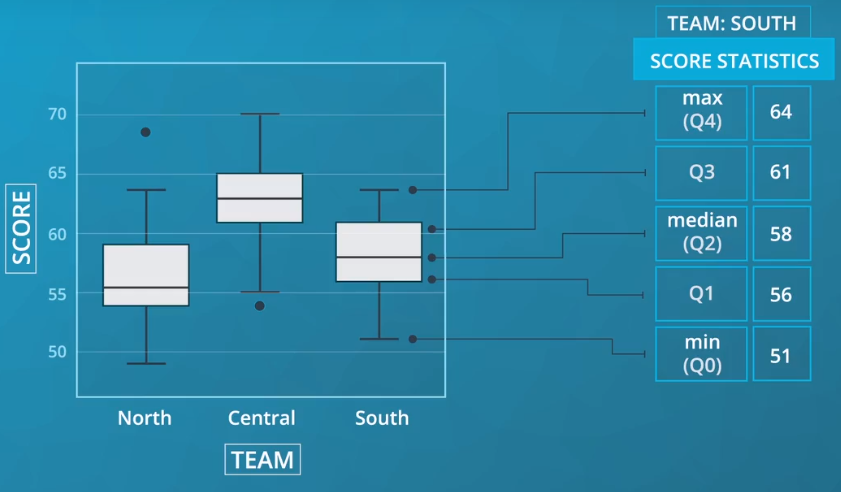

- 箱线图中，须线远处的点表示异常值。须线长度上限通常是 **四分位差或箱子高度的 1.5 倍**。

  > IQR（四分位差） = Q4 - Q3 的高度

- IQR（四分位差）计算

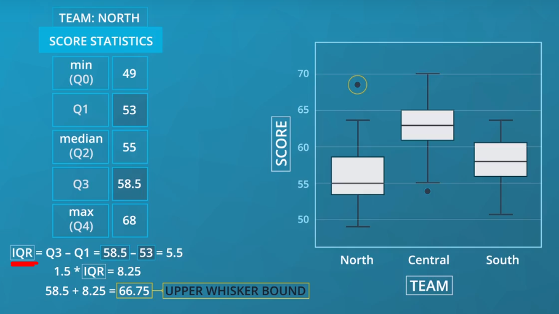

- 须线的两端是最大值和最小值,之外的点表示异常值，须线的长度则取决于盒子的高度,盒子越高 须越长。

### 聚类条形图

​	描述两个分类变量之间的关系，常用聚类条形图，既将单变量条形图扩展为**聚类条形图**。

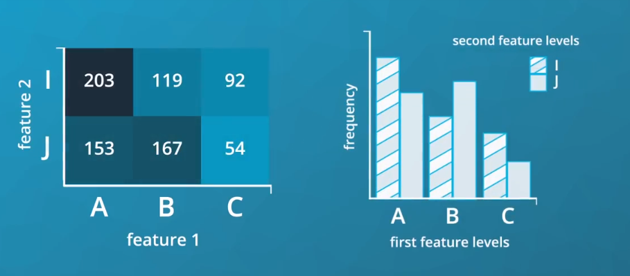

### 分面

- 把数据分成多个子集并用同一种图表分别绘制的技术称为**分面**
- 分面可用于任意类型的图表，而不止局限于柱状图。
- 分面擅长将可能很复杂的模式分解成多个较小的部分，如果分类变量有很多类别 分面会格外实用。

- 使用分面时，要注意每个子图的坐标轴刻度和范围应当保持一致，子图坐标轴范围不同，观察时就很容易误读各数据子集的总频率或值范围。

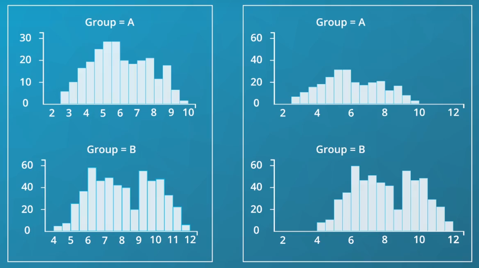

### 调整单变量图形

- 除了分面 也可以用 单变量图表描述双变量关系。

- 如果纵轴不表示频率 而表示平均值，那图表就自带双变量的性质了。

- 假设我们的游戏数据能记录一位玩家使用的策略， 那么这位玩家赢得了比赛时结果只能展示值 1 或 0，此时

  箱线图或小提琴图在此发挥不了作用。

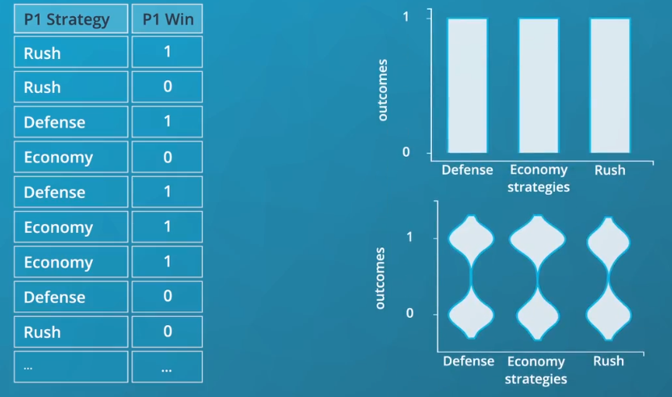

### 折线图

- 折线图 以 折线 表示两个定量变量之间的关系，**只不过 y 轴表示的是变量平均值， 而不是数量统计**。
- 折线图可以强调两点：
  - 折线图的 y 轴不一定从 0 开始。
  - 折线图强调了 x 轴各值的联系。如果 x 轴上的是无序分类变量， 那就不适合用折线图了
- 折线图明确地体现了相邻值的联系及值随时间发展的变化情况

### 总结

- 散点图描述的是两个定量变量之间的关系。
- 簇状柱形图描述的则是两个定性变量之间的关系。
- 热图可以看作二维直方图和柱状图。
- 小提琴图和箱线图则主要用于，描述定量变量和定性变量之间的关系。

- 通过用单变量图表描述双变量数据，从而研究复杂程度不一的各种数据，比如 根据第二个变量的子集，将单变量图表拆成多个分面 或使用第二个变量的平均值而非数量统计来绘图。

- 折线图可以表示时间与值变化的关系，通过这些双变量图表，你可以知道一个变量的变化是如何影响第二个变量的值的，也可以由此找出数据的分布和模式